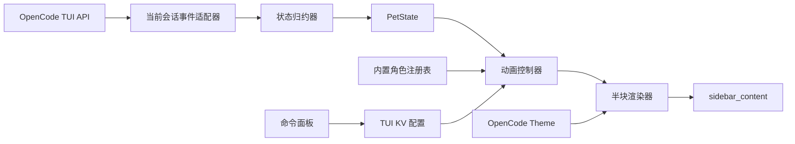

# 顶层架构

## 1. 架构目标

架构只解决一件事：把当前 OpenCode TUI 会话的生命周期事件，稳定地转成一个低成本的像素宠物侧栏组件。

不引入服务端插件、跨进程通信、模型工具、文件数据库或通用角色平台。

## 2. 系统边界



所有模块都在同一个 TUI 插件进程内。唯一外部输入是 OpenCode 提供的 API、事件、主题和 KV。

## 3. 组件职责

### 3.1 TUI 插件入口

负责：

- 声明稳定插件 ID。
- 注册 `sidebar_content` slot。
- 注册三项命令面板动作。
- 建立生命周期清理边界。
- 校验 OpenCode/API 能力，缺失时安全不渲染。

不负责：

- 连接 server plugin。
- 修改 `opencode.json`。
- 启动后台任务、HTTP 服务或外部进程。

### 3.2 当前会话事件适配器

把 SDK 的具体事件转换为小型领域事件：

```ts
type PetEvent =
  | { type: "cycle-started" }
  | { type: "reasoning-started" | "reasoning-ended" }
  | { type: "text-started" | "text-ended" }
  | { type: "tool-started" | "tool-ended"; callID: string }
  | { type: "permission-opened" | "permission-closed"; requestID: string }
  | { type: "question-opened" | "question-closed"; requestID: string }
  | { type: "retry-started" | "retry-ended" }
  | { type: "cycle-succeeded" | "cycle-failed" | "cycle-aborted" }
```

这不是要求代码照抄的公共 API，而是架构边界：SDK 变化只能影响适配器，状态机不应散布 OpenCode 事件字符串。

### 3.3 状态归约器

必须是可单元测试的纯逻辑核心：

- 输入旧事实与一个 `PetEvent`。
- 输出新事实和建议可见状态。
- 幂等处理重复结束事件。
- 用集合处理并发工具和 pending 请求。
- 不直接启动计时器或调用 UI。

### 3.4 动画控制器

负责：

- 选择当前状态的动画序列。
- 根据尺寸选择独立资源。
- 管理 success/error 瞬态期限。
- 在配置关闭、区块不可见或 lifecycle dispose 时停止计时。
- 限制更新频率不超过约 6 FPS。

状态归约器与动画时钟必须分开，避免测试依赖真实时间。

### 3.5 内置角色注册表

V1 只有一个时雨 manifest，但资源不应硬编码进视图条件分支。

```ts
type PetSize = "regular" | "compact"
type PetState = "idle" | "thinking" | "working" | "waiting" | "success" | "error" | "retry"

type PixelFrame = {
  width: 24 | 16
  height: 24 | 16
  pixels: Uint8Array
}

type AnimationSpec = {
  frames: readonly PixelFrame[]
  frameDurationMs: number
  loop: boolean
}

type CharacterManifest = {
  id: "shigure"
  displayName: "时雨"
  palette: readonly string[]
  sizes: Record<PetSize, Record<PetState, AnimationSpec>>
}
```

字段可在实现时微调，但以下约束不可改变：两尺寸独立资源、七状态齐全、索引调色板、明确帧时长和循环语义。

`CharacterManifest` 在 V1 是内部合同。不要发布角色包 schema、扫描用户目录或接受不可信资产。

### 3.6 半块渲染器

输入：逻辑像素矩阵、调色板、透明索引、主题背景。输出：OpenTUI 可渲染的文本/span 行。

每个字符合并上下两个像素：

| 上像素 | 下像素 | 输出 |
|---|---|---|
| 透明 | 透明 | 空格/透明 span |
| 有色 A | 透明 | `▀`，前景 A |
| 透明 | 有色 B | `▄`，前景 B |
| 同色 A | 同色 A | `█`，前景 A |
| 有色 A | 有色 B | `▀`，前景 A、背景 B |

要求：

- 不生成 ANSI 转义字符串再塞入普通文本；使用 OpenTUI 颜色/span 能力，避免宽度计算失真。
- 行宽严格等于逻辑像素宽度。
- 透明区域继承 sidebar panel 背景。
- 主题切换时只调整轮廓/对比色，不重写主体色。
- 相邻同色 run 可以合并 span，减少渲染节点。

### 3.7 配置持久化

配置只有：

```ts
{ enabled: true, size: "regular", animations: true }
```

- 用插件 ID 命名空间写入 `api.kv`。
- 对未知/非法值回退默认值。
- 未来新增字段必须向后兼容，不能把内部 manifest 暴露为配置。

## 4. 美术构建流

运行时不解码 PNG，也不向终端发送 PNG、Kitty、Sixel 或其他图片协议。概念 PNG 可以作为美术 Agent 的参考或构建期输入；它不是运行时接口。最终资源必须经过确定性的像素编译，变成调色板索引矩阵后随插件打包。

建议开发期采用：

```text
像素源图/图集
    ↓ build-time validator
尺寸、颜色、透明、帧数检查
    ↓ compiler
调色板 + Uint8Array/紧凑常量
    ↓ bundle
TUI runtime
```

构建工具的具体语言由开发 Agent 决定。不可省略的检查：

- 每个尺寸七种状态全部存在。
- 逻辑尺寸精确为 24×24 或 16×16。
- 调色板索引合法，透明索引一致。
- 至少一个非透明像素，边缘没有意外裁切。
- 动画帧时长在允许范围，整体不超过 6 FPS。

## 5. 生命周期与错误隔离

插件实例必须集中登记：

- event unsubscribe 函数。
- slot registration disposer。
- keymap layer disposer。
- animation timer。
- transient outcome timer。

`api.lifecycle.signal` 中止或 `onDispose` 触发时统一释放。清理应幂等。

错误策略：

```text
事件适配错误 → 忽略该事件 + debug 日志
状态异常     → 重水合当前会话
动画异常     → 当前状态首帧
资源异常     → 内置静态 idle
渲染异常     → 仅状态标签或空 slot
```

不得把异常抛到 OpenCode 的消息、权限或工具执行路径。

## 6. 包与安装边界

建议 npm 包：

- 根导出：TUI 插件模块。
- 可选 `/tui`：同一 TUI 模块的显式导出。
- peer dependency：与 OpenCode 1.18 对应的 `@opencode-ai/plugin` 与 OpenTUI 类型。
- 打包：Solid universal/OpenTUI 兼容模式，参考已发布 TUI 插件。
- 不提供 server 入口，不要求用户同时配置 `opencode.json`。

正式发布前必须以真实 npm 安装包测试，不能只验证 workspace link。

## 7. 可观测性

V1 不做遥测。仅允许使用 OpenCode 的结构化 debug 日志记录：

- 插件加载/卸载。
- 不支持的 API 能力。
- 资源校验或安全降级原因。
- 开发模式下的状态转换。

日志不能包含会话正文、工具输入输出、文件内容或敏感配置。

## 8. 未来扩展约束

以下抽象可以为未来保留，但不得在 V1 实现：

- 多角色 registry。
- 外部 manifest 校验。
- Desktop/Web renderer adapter。
- 英文或其他语言标签。

未来扩展必须以不破坏当前 `PetState`、两尺寸和本地隐私合同为前提。
